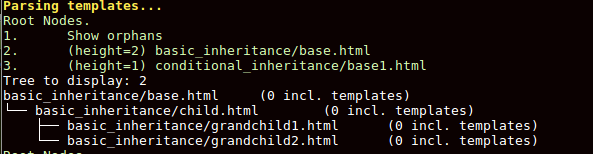
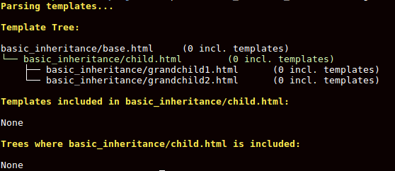
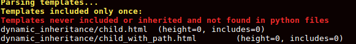

# Django Templates Forest (BETA)

Templates Forest is just a series of django commands that might help you
visualize your templates' inheritance and will give you some detailed
information about them so you could clean your template's structure

## Install

1. Add ``templates-forest`` to your requirements (and install it, via pip or something)
2. Add ``templates_forest`` to your ``INSTALLED_APPS``
3. Add ``APPLICATION_DIR`` to your settings. This is the path to your app

# How to use

There are currently three django commands and they all have the same common
parameters.

## Common parameters

- ``--quiet`` Will ignore the warnings and problems found when parsing the
  templates
- ``--include-packages`` If added, it will not only parse the templates on
  `APPLICATION_DIR` but also the installed packages (``INSTALLED_APPS``)
- ``--vars`` You can pass some variables that will be used in the template's
  context, for example when you use dynamic inheritance e.g.:
    ````
  you can call the command using: ``--vars my_var=foo.html``.

  For boolean variables you can pass ``True`` or ``False`` values, for example ``--vars my_var=False``

  It also works if the variable in the template is an attribute of an object: ``--vars foo.bar.aze=base.html``  

## templates_trees

Displays a list of trees found. For each tree we display the top template to
select which tree to display.

Next to each tree root we have the ``height`` of the three (the number of edges on the longest downward path between the root and a leaf)

## template_info ``<template path>``

Displays the information for a single template: His position inside a tree,
all the templates included inside this template, and the list of templates that include this template:

## templates_check

Using the template trees it will display a list of templates that we only
included once ("useless include") and the orphan templates that were never
included and that can't be found on the python files in ``APPLICATION_DIR``

